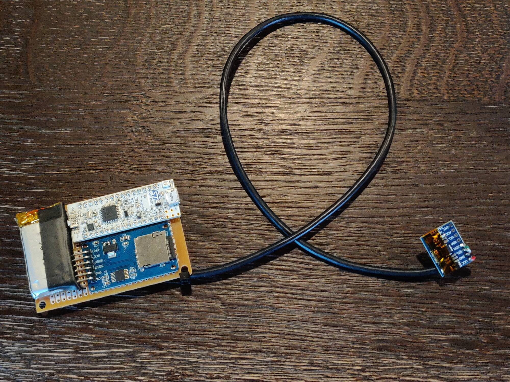

# Krokoměr pro psa

Tento projekt byl vypracován jako semestrální práce v předmětu A0M31ZLE na FEL ČVUT

Zařízení se skládá ze dvou částí spojených 40 cm kabelem
- logger (baterie a BMS, STM32G0 Nucleo, uSD karta)
- inerciální senzor (MPU6050)

Na SD kartu se zaznamenávají
- aktuální počet kroků se sekundovým intervalem, takže je možné vyhodnotit úroveň aktivity v průběhu měření
- veškerá neupravená inerciální data (gyroskop a akcelerometr) ve třech osách s frekvencí 250 Hz

## Obsluha

1. Připojte FAT32 naformátovanou uSD kartu
2. Zapněte napájení jumperem na dolní straně loggeru, zelená dioda LD3 na nucleo desce by měla začít problikávat - logger nahrává pohyby
3. Pokračujte se sběrem dat - procházka, cvičení a další aktivity
4. Pro ukončení nahrávání stiskněte tlačítko na dolní straně loggeru (hned pod uSD kartou), LD3 by měla začít dlouze blikat (s periodou 1s), nyní je možné vyjmout SD kartu
5. Pro opětovné spuštění stačí stisknout RST tlačítko na desce Nucleo, pro vypnutí odpojte jumper napájení

### Upevnění senzoru

Senzor upevněte na tlapku/dolní končetinu subjektu tak, aby přiléhal zadní stranou z vnější strany tlapky/dolní končetiny, na orientaci jinak nezáleží. Ideální umístění je hned za prvním kloubem od těla, tedy například stehno nebo předloktí.

### Chybové stavy

Rychlé blikání LD3 (s periodou 0.1s)
- SD karta není připojena nebo je špatně naformátována
- nastala chyba během ukládání dat
- inerciální senzor se nepodařilo inicializovat

## Princip měření

Vyhodnocují se pouze data osy Z gyroskopu, neboli úhlová rychlost otáčení dané části končetiny. Zařízení vyhodnocuje data v reálném čase a zaměřuje se na dopředné švihy končetiny s následným protichůdným pohybem zpět, což je charakteristické pro chůzi a dobře detekovatelné pro různé rychlosti.

## Vyhodnocení uložených inerciálních dat

Zařízení po každém spuštění záznamu vytvoří nový soubor pro daný záznam. 

Každá řádka souboru představuje jeden časový okamžik, přičemž oba typy zaznamenaných dat jsou v jednom souboru, takže existují dva formáty
- inerciální data ve formátu `acc.x,acc.y,acc.z;temp_d;gyro.x,gyro.y,gyro.z`
- kroky ve formátu `čas=kroky`, čas je v milisekundách od spuštění

Řádky je možné od sebe odlišit sledováním znaku `=`, první řádek souboru je potřeba ignorovat. Přiložený python skript je možné použít pro vizualizaci dat, stačí jej spustit příkazem `python analyze.py cesta_k_souboru`.

